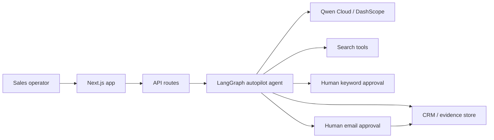

# Waimao Agent Platform

Waimao Agent Platform is a B2B export sales autopilot agent for small foreign-trade teams. It turns one product name into a reviewed lead-generation workflow: translate and normalize the product, generate buyer-intent search keywords, wait for human approval, discover candidate companies, merge evidence, score buyer fit, draft a first-touch email, and pause again before any outreach action.

This repository is the hackathon build for the Global AI Hackathon Series with Qwen Cloud, Track 4: Autopilot Agent.

## Demo Story

Foreign trade teams often research one product at a time by hand: translate product terms, search for importers, check websites, judge whether a company is a real buyer, write a first email, and record everything in a CRM. Waimao Agent Platform makes that loop repeatable while keeping people in the risk points.

The demo input is:

```txt
Product: diaphragm accumulator
Target markets: Mexico, Chile, Peru
Target count: 10 companies
```

The agent uses Qwen Cloud to reason over the product, plan search queries, score evidence, and draft outreach. Humans approve keywords before web search and approve email drafts before outreach.

## What It Does

- Normalizes product names and translates Chinese or mixed-language input into concise English product terms.
- Generates B2B buyer-intent keywords for importers, distributors, dealers, repair/service companies, and industrial buyers.
- Requires human keyword approval before search begins.
- Runs a LangGraph.js workflow across search, enrichment, evidence merge, scoring, draft generation, review, and CRM save steps.
- Uses Qwen Cloud for content reasoning, JSON outputs, tool-search planning, buyer-fit scoring, and evidence-based cold-email drafting.
- Stores each company with evidence, score, reasons, risks, suggested action, and review status.
- Requires human approval or skip before a draft is treated as ready for outreach.

## Qwen Cloud Usage

The Qwen integration lives in `src/providers/qwenProvider.ts` and is selected through `CONTENT_MODEL_PROVIDER=qwen`.

Qwen Cloud is used for:

- Product normalization.
- Keyword generation.
- Tool-search planning with JSON query plans.
- Buyer-fit scoring from saved evidence.
- Cold-email drafting using only saved evidence.

The provider calls the OpenAI-compatible DashScope endpoint:

```env
QWEN_BASE_URL=https://dashscope-intl.aliyuncs.com/compatible-mode/v1
QWEN_MODEL=qwen-plus
```

Real mode is enabled only when both an API key and `QWEN_REAL_MODE=true` are present. Otherwise the app falls back to mock-safe behavior for local demos.

## Human Review Gates

The system is designed for reviewed automation, not blind automation.

- Keyword gate: the reviewer approves useful search terms and rejects broad or noisy ones before any lead search runs.
- Email gate: Qwen drafts the email, but a person must approve, save, or skip the draft before outreach.
- Evidence rule: scoring and email generation must use stored evidence; the model is instructed not to invent websites, contact details, social links, or buyer claims.
- Sending guardrail: production email sending defaults to disabled until sender setup and approval rules are verified.

## Architecture

Architecture documents:

- [Architecture Notes](docs/architecture.md)
- [Architecture Diagram PNG](docs/architecture.png)
- [Architecture Diagram SVG](docs/architecture.svg)
- [Alibaba Cloud Deployment Proof Checklist](docs/alibaba-cloud-deployment-proof.md)

High-level flow:



## Tech Stack

- Next.js, React, TypeScript
- Tailwind CSS
- LangGraph.js
- Qwen Cloud / DashScope OpenAI-compatible API
- Supabase-ready persistence with local JSON fallback
- BullMQ / Redis-ready background queue
- Search provider router with mock-safe local mode
- Resend / SMTP-ready email provider, disabled by default

## Quick Start

Install dependencies:

```bash
npm install
```

Create a local environment file:

```bash
copy .env.example .env
```

On macOS or Linux:

```bash
cp .env.example .env
```

Seed demo data:

```bash
npm run seed
```

Start the app:

```bash
npm run dev
```

Open:

```txt
http://127.0.0.1:3000
```

## Qwen Cloud Configuration

For a local mock-safe run, keep `QWEN_REAL_MODE=false`.

For a real Qwen Cloud demo deployment:

```env
CONTENT_MODEL_PROVIDER=qwen
QWEN_REAL_MODE=true
QWEN_API_KEY=your_qwen_or_dashscope_key
QWEN_BASE_URL=https://dashscope-intl.aliyuncs.com/compatible-mode/v1
QWEN_MODEL=qwen-plus
PRODUCT_SEARCH_CONTENT_MODEL_TOOL_QUERIES=1
```

Do not commit `.env` or real API keys.

## Useful Commands

```bash
npm run dev
npm run build
npm run start
npm run lint
npm run typecheck
npm run seed
```

Optional worker mode:

```bash
npm run worker
```

## Alibaba Cloud Deployment Proof

For Devpost, deploy this hackathon build on Alibaba Cloud ECS or Simple Application Server and use Qwen Cloud for the model provider.

Recommended proof assets:

- Public app URL.
- Screenshot or short clip of the Alibaba Cloud instance/application.
- Screenshot or clip showing the environment variables without exposing secrets.
- Server log showing the app running.
- App screen showing a workflow run with provider `qwen`.
- This repository link, architecture diagram, and the 3-minute demo video link.

See [docs/alibaba-cloud-deployment-proof.md](docs/alibaba-cloud-deployment-proof.md).

## Devpost Checklist

- Public repository URL.
- Open-source license: MIT.
- Track: Autopilot Agent.
- Qwen Cloud usage explanation.
- Alibaba Cloud deployment proof.
- Architecture diagram.
- 3-minute public or unlisted video URL.
- Written submission text.

Prepared submission copy is in [docs/devpost-submission.md](docs/devpost-submission.md).

## Repository Safety

- `.env` files are ignored.
- `node_modules`, `.next`, Playwright profiles, logs, and local CRM JSON data are ignored.
- Real customer data should never be committed.
- Email sending defaults to mock/disabled mode until a reviewer-approved production path is configured.

## License

MIT. See [LICENSE](LICENSE).
