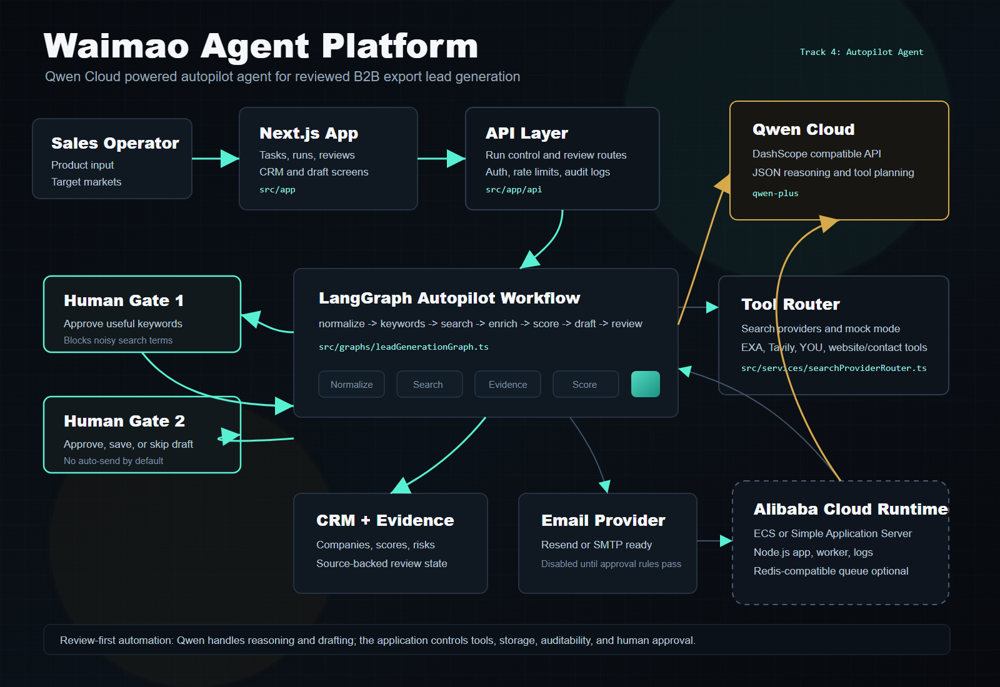
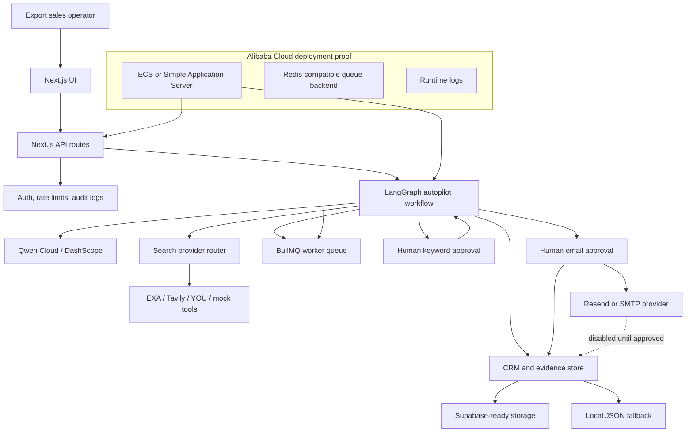

# Waimao Agent Platform Architecture

Waimao Agent Platform is a reviewed autopilot workflow for B2B export lead generation. The core idea is simple: let the agent handle repetitive research and drafting, but keep humans in the approval points where business risk appears.

## System Diagram

## Runtime Responsibilities

- The Next.js UI collects product input, target markets, review decisions, and CRM actions.
- API routes start runs, read run status, approve keywords, approve email drafts, and expose review queues.
- LangGraph.js orchestrates the autopilot workflow in deterministic steps.
- Qwen Cloud performs reasoning-heavy tasks: normalization, keyword generation, tool-search planning, scoring, and draft generation.
- Search providers return candidate websites and contact evidence. The app can run in mock-safe mode for demos.
- CRM/evidence storage records sources, confidence, score, risks, and review state.
- Human review gates prevent broad keywords and unapproved outreach from advancing automatically.
- Rate limits and audit logs protect production actions.

## Autopilot Workflow

1. `normalizeInput`: clean the product name and target-market intent.
2. `generateKeywords`: ask Qwen for buyer-intent B2B search terms.
3. `humanApproveKeywords`: pause until a reviewer approves useful keywords.
4. `searchCustomersByProduct`: find candidate companies from approved terms.
5. `extractCompanyDetails`: convert search results into normalized company candidates.
6. `enrichCompanies`: collect additional public evidence.
7. `discoverWebsite`: resolve official company websites where possible.
8. `discoverContacts`: look for contact paths without inventing data.
9. `mergeEvidence`: merge search, website, and contact evidence.
10. `scoreBuyerFit`: ask Qwen to score fit using saved evidence only.
11. `generateEmailDraft`: ask Qwen to draft a first-touch email using saved evidence only.
12. `humanApproveEmail`: pause for approve, save, or skip.
13. `saveToCrm`: persist reviewed companies, scores, risks, and next actions.

## Qwen Cloud Boundary

Qwen is used as the content and reasoning model. It does not directly send emails or write to the CRM. The app wraps Qwen outputs in typed JSON normalization and keeps downstream actions under application and reviewer control.

## Human-in-the-loop Boundary

The workflow includes two explicit approval nodes:

- Keyword approval blocks noisy terms before they create noisy search results.
- Email approval blocks unreviewed outreach and protects customer-facing communication.

This makes the agent useful for real business workflows while still being auditable and safe to demo.
