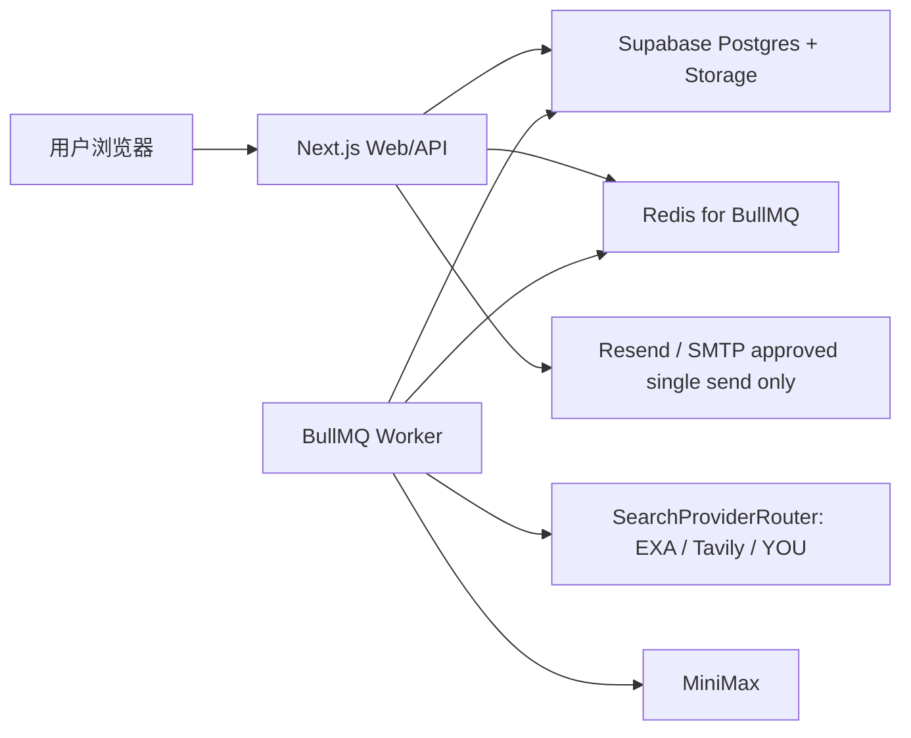

# 外贸 Agent 生产上线清单

这份清单用于正式上线当前系统：Supabase 数据库存储、BullMQ + Redis 后台任务、MiniMax、EXA/Tavily/YOU、Resend/SMTP 单封邮件发送。

当前原则：

- 100 家以上公司不建议继续使用同步执行。
- 生产环境建议开启 `QUEUE_ENABLED=true`，并独立运行 `npm run worker`。
- Redis 是任务队列，不是业务数据源；Supabase 才是客户、证据、草稿、邮件日志的主数据源。
- 第一版仍然不允许自动群发，不允许未审核邮件发送。
- 跨境搜 / 外贸搜 / 外贸通 Playwright 线路必须保持关闭。

## 1. 推荐生产架构



必须有两个长期运行进程：

- Web/API：`npm run start`
- Worker：`npm run worker`

如果部署在 Vercel，Vercel 只适合跑 Web/API；Worker 需要部署到 Railway、Render、Fly.io、VPS、Docker、PM2 或其他支持常驻进程的平台。

## 2. 100+ 公司任务建议

正式使用时：

- `QUEUE_ENABLED=true`
- `WORKER_CONCURRENCY=1`
- Redis 使用托管 Redis 或自建 Redis，并开启持久化。
- 先用 5-10 家公司做一次完整链路验证，再跑 100+。

当前 Worker 处理 Excel 导入时会分批循环：

- 官网/联系方式补全：默认每批最多 20 家。
- Buyer Fit 评分：默认每批最多 10 家。
- 邮件草稿生成：只生成草稿，进入人工审核。

同步模式可以保留，但只作为兜底：

- 本地调试可以同步跑。
- Redis 不可用时会 fallback 同步执行。
- 100+ 公司同步跑可能慢、可能页面等待过久，不建议生产依赖。

## 3. 环境变量

以 `.env.production.example` 为模板配置生产环境。

核心配置：

```env
NODE_ENV=production
DATA_STORE_PROVIDER=supabase
NEXT_PUBLIC_SUPABASE_URL=
NEXT_PUBLIC_SUPABASE_ANON_KEY=
SUPABASE_SERVICE_ROLE_KEY=
SUPABASE_STORAGE_BUCKET_IMPORTS=imports

REDIS_URL=redis://localhost:6379
QUEUE_ENABLED=true
QUEUE_NAME_LEAD_GENERATION=lead-generation
WORKER_CONCURRENCY=1

CROSS_SEARCH_ENABLED=false
CROSS_SEARCH_REAL_MODE=false

EMAIL_SEND_REAL_MODE=false
EMAIL_PROVIDER=mock
```

上线前安全要求：

- `SUPABASE_SERVICE_ROLE_KEY` 只能放服务端环境变量，不能出现在 `NEXT_PUBLIC_`。
- `RESEND_API_KEY`、`SMTP_PASSWORD`、MiniMax/Search API Key 都不能暴露到前端。
- 你曾经在聊天里贴过真实 Supabase secret 和搜索 API Key，正式上线前建议全部轮换一次。

## 4. Supabase

### 4.1 初始化 schema

在 Supabase SQL Editor 执行：

```sql
-- 复制并执行 supabase/schema.sql
```

如果之前已经创建过 schema，再执行队列状态迁移：

```sql
-- 复制并执行 supabase/queue-status-migration.sql
```

这个迁移只做一件事：让 `runs.status` 允许 `queued`。

### 4.2 Storage

确认存在私有 bucket：

```text
imports
```

Excel 文件路径约定：

```text
organizations/{organizationId}/imports/{importJobId}/{fileName}
```

不要把 `imports` bucket 设为 public。

### 4.3 Data API / RLS 注意

Supabase 2026-04-28 起，新表不一定自动暴露给 Data API。当前项目主要用 service role 在服务端访问，正常不会受前端 anon 访问影响；但如果后续做用户登录和前端直连表，需要补显式 `GRANT` 和 RLS policy。

当前阶段建议：

- 服务端继续使用 `SUPABASE_SERVICE_ROLE_KEY`。
- 前端不要直接读写业务表。
- RLS 保持开启。
- 正式做多用户/多组织登录前，再细化 organization 级别 policy。

## 5. Redis / BullMQ

### 5.1 本地 Redis

Docker 示例：

```powershell
docker run -d --name waimao-redis -p 6379:6379 redis:7
```

生产建议：

- 使用托管 Redis 或自建 Redis。
- 使用 TCP Redis URL，例如 `redis://...` 或 `rediss://...`。
- 不要使用只支持 HTTP/REST 的 Redis 产品形态，BullMQ 需要普通 Redis 连接。
- 开启 AOF 或 RDB 持久化，避免 Redis 重启时丢失未执行 job。

### 5.2 测试 Redis

启动 Web 后访问 `/settings`，点击“测试 Redis 连接”。

API 也可以直接测：

```powershell
Invoke-RestMethod -Method Post -Uri "http://localhost:3001/api/settings/test-redis"
```

期望：

```json
{
  "ok": true,
  "queueEnabled": true,
  "redisConnected": true,
  "message": "Redis connected"
}
```

## 6. 启动命令

安装依赖：

```powershell
npm ci
```

构建：

```powershell
npm run build
```

启动 Web：

```powershell
npm run start
```

启动 Worker：

```powershell
npm run worker
```

PM2 示例：

```powershell
npm install -g pm2
pm2 start npm --name waimao-web -- run start
pm2 start npm --name waimao-worker -- run worker
pm2 save
```

Docker/平台部署时也保持两个进程：一个 Web，一个 Worker。

## 7. 上线前验收

代码检查：

```powershell
npm run typecheck
npm run lint
npm run build
```

服务检查：

- `/settings` 显示 Supabase 已配置。
- `/settings` Redis 测试通过。
- `/settings` 搜索 provider 至少一个 configured。
- `/settings` 邮件发送 real mode 保持 false，直到发信域名验证完成。
- `/settings` 跨境搜旧线路显示已关闭。

业务检查：

- 上传 5 行 Excel，确认导入。
- 点击补全官网和联系方式，确认进入队列或同步 fallback。
- 打开 `/runs/[id]`，能看到 queue status / jobId / current queue step。
- Worker 日志能看到 job completed。
- `/companies` 能看到客户、evidence、contactConfidence。
- 开始 Buyer Fit 评分，确认评分结果写入公司。
- 生成开发信草稿，确认进入 `/reviews` 人工审核。
- 批准单封草稿后，只有 approved 才显示发送按钮。
- `EMAIL_SEND_REAL_MODE=false` 时发送只记录 mock，不真实发出。

## 8. 日志和监控

最低要求：

- Web 进程日志：请求错误、API 错误、build/start 错误。
- Worker 进程日志：job started、completed、failed。
- Supabase：关注数据库错误、连接数、存储用量。
- Redis：关注内存、连接数、持久化状态、重启记录。

项目内会记录：

- `runs.status`
- `runs.metadata.queueStatus`
- `runs.metadata.queueJobId`
- `runs.metadata.queueError`
- `run_steps`
- `email_logs`
- `evidence`

失败排查顺序：

1. `/runs/[id]` 看当前步骤和错误。
2. Worker 日志看 job fail 原因。
3. `/settings/test-redis` 看 Redis。
4. `/settings/test-supabase` 看数据库。
5. 搜索 API / MiniMax / 邮件 provider 各自测试。

## 9. 备份

Supabase：

- 开启 Supabase 项目备份；正式商用建议使用支持 PITR 的付费方案。
- 定期导出关键表：companies、evidence、email_drafts、email_logs、import_jobs、runs。
- Storage bucket `imports` 也要备份，里面是上传的原始 Excel。

Redis：

- Redis 不是最终业务数据源，但保存尚未执行/正在执行的 BullMQ job。
- 开启 AOF 或 RDB。
- Redis 丢失时，已入库的 importJob/company/run 还在 Supabase，可重新触发对应任务。

密钥：

- `.env` 不要提交。
- 生产环境变量只放在部署平台 secret/env 面板。
- 定期轮换 Supabase service role、MiniMax、EXA/Tavily/YOU、Resend/SMTP 密码。

## 10. 回滚和故障恢复

关闭队列临时回滚：

```env
QUEUE_ENABLED=false
```

然后重启 Web。系统会回到同步执行模式。

Worker 停止：

- 已在 Redis 的 pending job 会保留。
- 重启 `npm run worker` 后继续消费。

Job 失败：

- BullMQ 默认重试 2 次。
- 失败后 run 会写入 `metadata.queueError`。
- 修复配置后，可以重新点击对应按钮：补全、评分、生成草稿。

邮件发送故障：

- 只影响单封邮件。
- 不会自动群发。
- 非 approved 状态仍然不能发送。

## 11. 上线顺序

建议按这个顺序来：

1. 轮换所有曾经暴露过的 API Key。
2. 配好 Supabase schema、Storage、环境变量。
3. 配好 Redis，并确认持久化。
4. 部署 Web。
5. 部署 Worker。
6. `/settings` 逐项测试。
7. 用 5 行 Excel 做端到端测试。
8. 用 100 行 Excel 做真实压力验证。
9. 再开放正式使用。

## 12. 仍然禁止的事情

- 不启用跨境搜 / 外贸搜 / 外贸通 Playwright。
- 不访问 `vip.dqxx.com.cn`。
- 不访问 `sesb.dqxx.com.cn`。
- 不自动群发邮件。
- 不发送未审核邮件。
- 不把 service role key、SMTP 密码、Resend API Key 暴露到前端。

## 13. 安全、限速、审计

生产环境默认开启：

```env
SECURITY_RATE_LIMIT_ENABLED=true
SECURITY_RATE_LIMIT_BACKEND=redis
SECURITY_AUDIT_LOG_ENABLED=true
```

当前限速策略：

- 创建产品搜索任务：`RATE_LIMIT_RUNS_START_PER_MINUTE=5`
- Excel 补全：`RATE_LIMIT_IMPORT_ENRICH_PER_MINUTE=12`
- Buyer Fit：`RATE_LIMIT_BUYER_FIT_PER_MINUTE=12`
- 生成开发信草稿：`RATE_LIMIT_EMAIL_DRAFT_PER_MINUTE=10`
- 单封邮件发送：`RATE_LIMIT_EMAIL_SEND_PER_5_MINUTES=3`
- CSV 导出：`RATE_LIMIT_COMPANIES_EXPORT_PER_5_MINUTES=10`
- 人工审核操作：`RATE_LIMIT_REVIEW_ACTION_PER_MINUTE=30`
- CRM 写操作：`RATE_LIMIT_CRM_WRITE_PER_MINUTE=30`
- 设置页测试接口：`RATE_LIMIT_SETTINGS_TEST_PER_MINUTE=20`
- 搜索 provider 全局调用：`RATE_LIMIT_SEARCH_PROVIDER_PER_MINUTE=30`
- MiniMax 全局调用：`RATE_LIMIT_MINIMAX_PER_MINUTE=20`

限速后端：

- `SECURITY_RATE_LIMIT_BACKEND=redis`：优先用 Redis。
- Redis 不可用时自动降级到内存限速。
- 内存限速只保护单个进程；多实例生产部署必须使用 Redis。

审计日志：

- 审计表：`audit_logs`
- schema 初始化后已有表。
- 已经上线过 schema 的项目，需要额外执行：

```sql
-- 复制并执行 supabase/audit-logs-migration.sql
```

会记录的关键操作：

- 创建产品搜索任务
- Excel 补全
- Buyer Fit 评分
- 生成开发信草稿
- 单封邮件发送
- CSV 导出
- 客户状态修改、备注、拉黑
- 关键词审核、邮件审核、跳过、保存草稿
- 设置页测试 Redis / Supabase / Search / Email / Cross Search disabled 状态
- Worker job 成功、失败、进入人工审核

审计日志包含：

- action
- resource_type / resource_id
- status: success / failure / blocked
- ip_address
- user_agent
- request_id
- metadata
- error_message

日志安全：

- 结构化日志会自动脱敏 key、token、secret、password、authorization、cookie。
- 审计 metadata 也会做脱敏。
- 不记录 Resend API Key、SMTP 密码、Supabase service role key。

上线检查：

1. 执行 `supabase/audit-logs-migration.sql`。
2. `/settings` 查看“安全 / 限速 / 审计”区块。
3. 连续快速点击某个测试按钮，应该出现 429 限速。
4. 在 Supabase SQL Editor 查询：

```sql
select action, status, created_at
from public.audit_logs
order by created_at desc
limit 20;
```

5. Worker 运行任务后，确认 `queue.*` action 被写入审计表。
